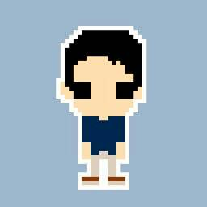

# 「おはよう」から「おやすみ」まで

OpenClaw の家電操作から始める AI 生活

t0yohei @ 🦞ClawCon Tokyo

---
layout: center
class: text-center
---

# t0yohei について

  

    
  

  

    
- Web アプリ開発のフリーランスエンジニア

    
- 最近は OpenClaw と遊ぶのが趣味

  

---
layout: center
class: text-center
---

# やろうとしてること

- Discord で OpenClaw に話しかける
- 音声から意図を判定する
- 家電を fastpath で操作する

Discord音声 
→ STT 
→ audio-router 
→ intent 判定 
→ 家電操作

---
layout: center
class: text-center
---

# Demo

おはよう 
暖房つけて 
おやすみ

Google Meet で部屋を映しながら、Discord から実際に送る

---
layout: center
class: text-center
---

# How it works

Discord音声 
↓ 
高速STT (local fstt) 
↓ 
message:transcribed 
↓ 
audio-router 
├─ local Ollama で intent 判定 
├─ transcript の揺らぎ補正 
└─ fastpath なら即 API 実行 
↓ 
SwitchBot API 
↓ 
照明 / エアコン

家電操作は main agent の返答を待たずに先に処理 
雑談や複雑な依頼は main 側に渡す

---
layout: default
---

# 3秒以内に操作を終わらせたかった

やったこと 1: STT を local / 高速化

標準の重い経路ではなく、高速な STT を local で利用

やったこと 2: local LLM (Ollama) で意図判定

通信 overhead を減らし、STT の揺らぎ補正と intent 判定をまとめて処理

やったこと 3: hook で fastpath 実行

main agent の返答を待たずに家電操作だけ先に処理

遅い部分をできるだけ main agent の外に逃がした

---
layout: center
class: text-center
---

# Next

- Discord を使わずに、OpenClaw に話しかけるだけで操作できるようにしたい
- 家電以外のことも、会話で OpenClaw に頼めるようにしたい

Google Home のように自然に呼び出せるようにして、 
家電操作だけでなく、日常の頼み事にも広げたい

