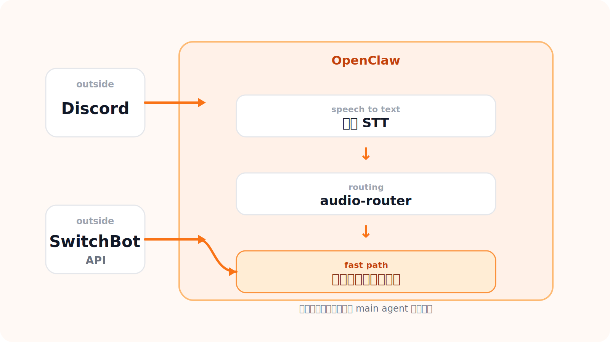

# 「おはよう」から「おやすみ」まで

OpenClaw の家電操作から始める AI 生活

t0yohei @ 🦞ClawCon Tokyo

---
layout: center
class: text-center
---

# t0yohei について

  

    
  

  

    
- Web アプリ開発のフリーランスエンジニア

    
- 最近は OpenClaw と遊ぶのが趣味

  

---
layout: center
class: text-center
---

# やりたいこと

「おはよう」で電気をつけて、 
「おやすみ」で電気を消す。

---
layout: center
class: text-center
---

# Demo

  <iframe
    width="960"
    height="540"
    src="https://www.youtube.com/embed/fnO_I4Hi8lk"
    title="Demo video"
    frameborder="0"
    allow="accelerometer; autoplay; clipboard-write; encrypted-media; gyroscope; picture-in-picture; web-share"
    allowfullscreen
    class="rounded-2xl shadow-lg border border-gray-200 max-w-full"
  ></iframe>

---
layout: center
class: text-center
---

# How it works

---
layout: default
---

# 工夫ポイント: 3秒以内に操作を終わらせたい

1: STT を local / 高速化

　　高速な faster-whisper
 の STT を local で利用

2: hook で fastpath 実行

　　main agent の返答を待たずに家電操作だけ先に処理

3: 正規表現・local LLM (Ollama) で意図判定

　　通信 overhead を減らし、STT の揺らぎ補正と intent 判定をまとめて処理

遅い部分をできるだけ main agent の外に逃がした

---
layout: center
class: text-center
---

# Next

Discord を使わずに、OpenClaw に話しかけるだけで操作できるようにしたい

家電以外のことも、会話で OpenClaw に頼めるようにしたい

