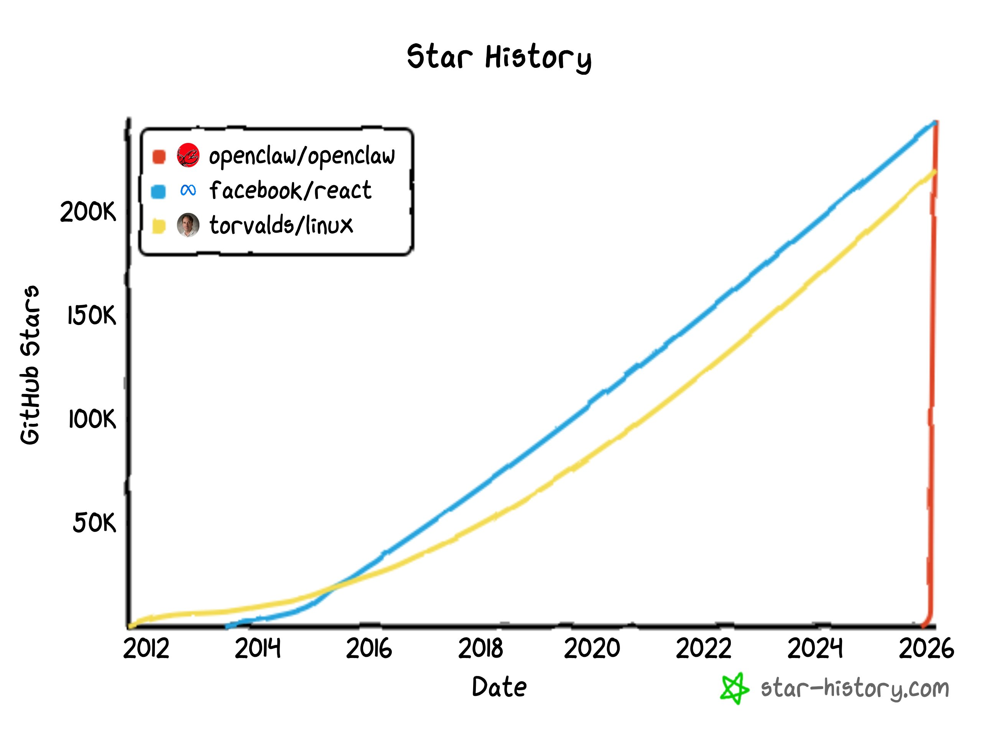
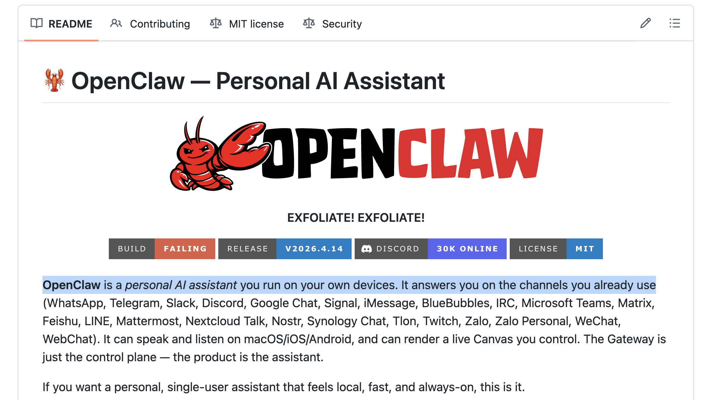
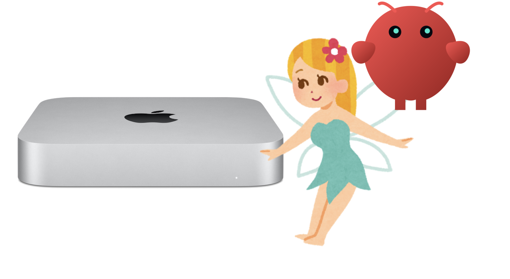
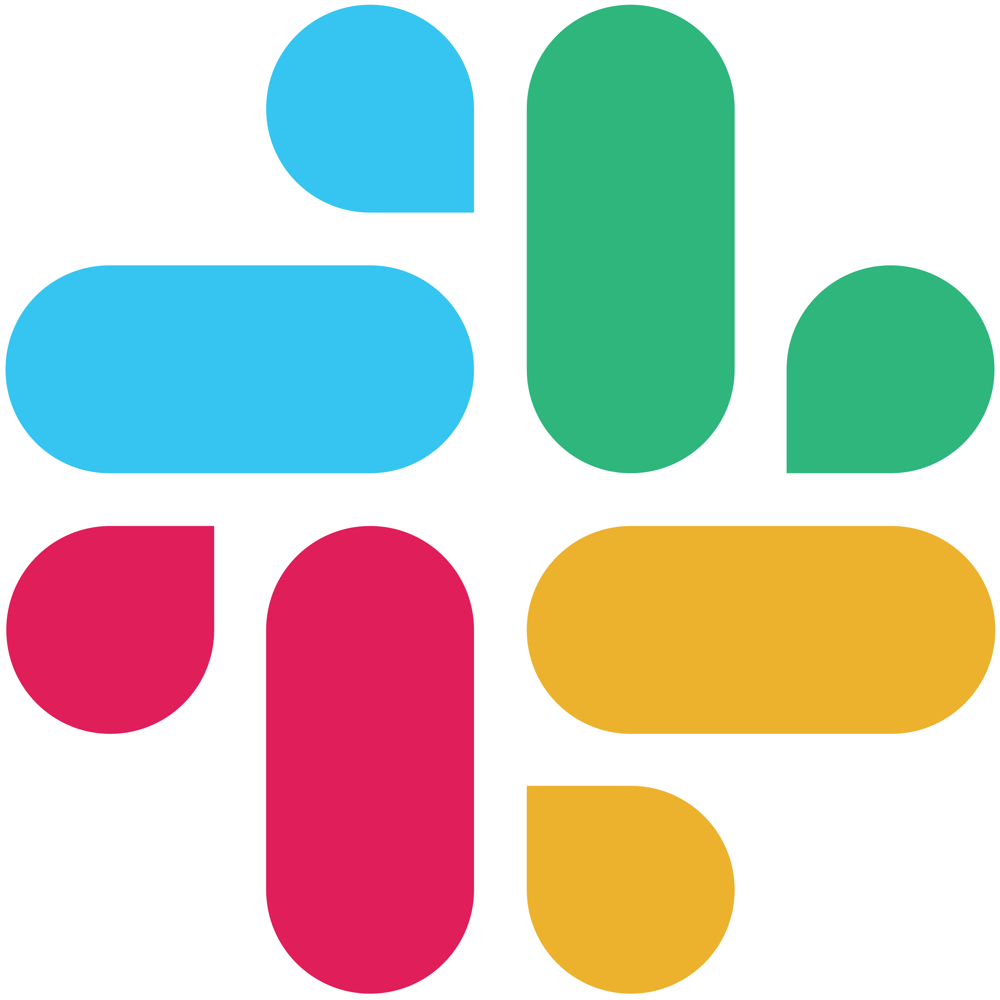
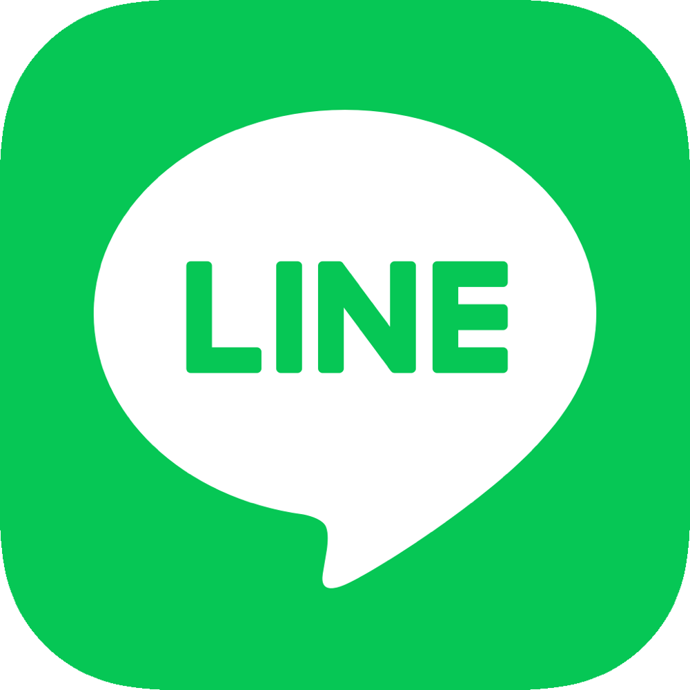
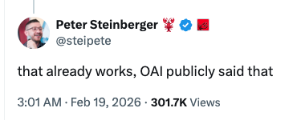
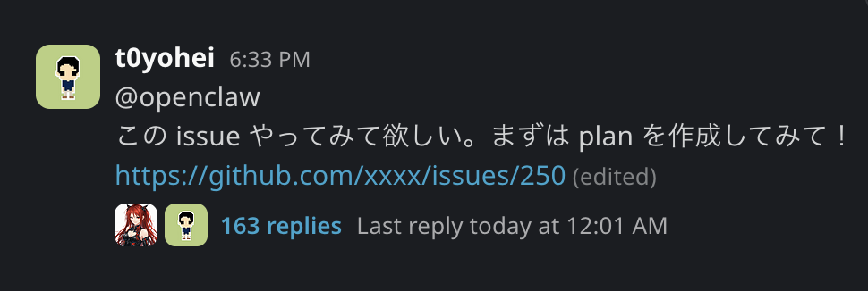
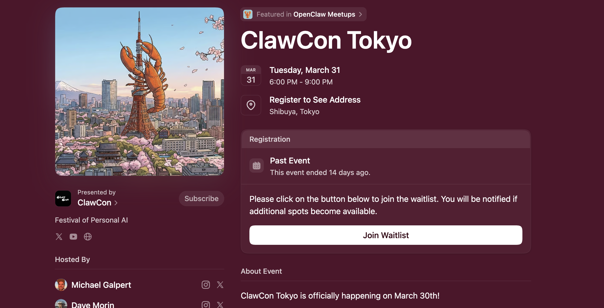
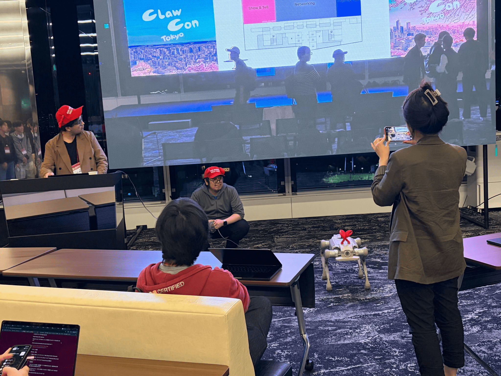
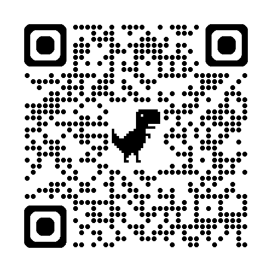

# OpenClaw は何が偉大だったのか

~ Re: OpenClaw と始める AI 生活 ~

t0yohei @ 五反田AI vol.2

---
layout: center
class: text-center
---

# t0yohei について

  

    
  

  

    
- Web アプリ開発のフリーランスエンジニア

    
- 最近は OpenClaw と遊ぶのが趣味

  

---
layout: center
class: text-center
---

---
layout: center
class: text-center
---

# Star 数がついに linux, React を超えた

---
layout: center
class: text-center
---

  <h1>OpenClaw は何が偉大だったのか</h1>

---
layout: center
class: text-center
---

  
OpenClaw が与えたのは、単なる便利ツールではなく、

  
「自分専用の相棒を持てるかもしれない」という感覚

---
layout: center
class: text-center
---

# OpenClaw とは

OpenClaw は、自分のデバイス上で実行できるパーソナルAIアシスタントです。

Slack、Discord、Line など普段使っているチャネルを通してあなたに応答します。

ローカルで動作し、高速で、常に利用可能なあなただけのパーソナルアシスタント。

---
layout: two-cols
layoutClass: gap-10
---

# 要はパーソナルAIアシスタント

<ul class="mt-10 mx-auto max-w-2xl text-left text-2xl leading-[3.2rem] list-disc pl-8">
  <li>自分専用</li>
  <li>自分の環境で動く</li>
  <li>自分の日常に入り込める</li>
</ul>

---
layout: two-cols
layoutClass: gap-10
---

# 他の AI Agent とはどう違うか

### Claude Code などの AI Agent

- 動く場所: 基本的に個人の PC 上
- 利用者: 個人
- 役割: 個人に依存する coding や日々のタスクの支援・遂行
- ex) Codex, Claude Code, Claude Cowork

::right::

### Claude Agent SDK などで作る AI Agent

- 動く場所: クラウドや物理のサーバー上
- 利用者: 複数人
- 役割: 個人に依存しない汎用タスクを支援
- ex) ChatGPT, Grok, Devin

---
layout: center
class: text-center
---

# OpenClaw の立ち位置は？

  <ul class="text-2xl leading-[3.2rem] list-disc pl-8">
    <li>動く場所: Mac mini やクラウド上のサーバーなど</li>
    <li>利用者: 基本的には個人</li>
    <li>役割: 個人の日々の営みを支援する</li>
  </ul>
  

---
layout: center
class: text-center
---

# OpenClaw じゃなくて Claude Code で良くね？

半分 Yes

Claude Agent SDK を Mac mini などに入れて、 
個人用にカスタムしまくれば OpenClaw みたいになる

---
layout: default
---

  <h1>OpenClaw は何が特別だったのか</h1>

---
layout: default
---

OpenClaw がやったこと

「わたし専用の AI Agent」という概念と体験を人々に与えた

その上で「あなたはこれを使って何をしますか？」という問いを人々に与えた

だから、想像力が爆発した

---
layout: center
class: text-center
---

# どういうことか

体験の設計を分解してみる

---
layout: center
class: text-center
---

# 名前を与えることから始まる Onboarding

Onboarding の瞬間から、 
あなたの相棒・パートナー・アシスタントという体験が始まる

---
layout: center
class: text-center
---

# 普段使いのチャネルへの接続

<ul class="mt-10 inline-block text-left text-2xl leading-12 list-disc pl-6">
  <li>Slack、Discord、Line などへの接続</li>
  <li>より馴染み深い存在へ</li>
</ul>

  
  
  

---
layout: default
---

# 豊富な integration, plugin, skill, heartbeat

- Brave, Ollama, 1password, github, notion, openhue, peekaboo, etc...
- より有能なアシスタントへ

---
layout: default
---

# 記憶システム

- 短期記憶としての session
- 中期記憶としての daily memory
- 長期記憶としての MEMORY.md
- built in の記憶検索システム

---
layout: default
---

# カスタマイズ性と危険なホスト実行

- skill, plugin, cron, hook, tool, ACP
- 「自分専用」に育てる余地が大きい
- でも、ホスト実行で動かしたら本当にいろいろできてしまう

---
layout: center
class: text-center
---

# それで何をやるのかは、わたしの・あなたの想像力次第

  
OpenClaw をホスト実行で動かしたら、なんでもできちゃう。

  
だからこそ、「自分なら何に使うか」が一番大事になる。

  
大いなる力には、大いなる責任が伴う

  
MY OPENCLAW

  
私は何をやってるのか

---
layout: center
class: text-center
---

# 私の OpenClaw

赤髪の女の子

---
layout: default
---

# 与えているもの

- Mac mini (メモリ 24GB, SSD 512GB)
- ChatGPT Pro のサブスク
- Google Account, GitHub Account, etc...

  

---
layout: default
---

# 私の使い方

- 個人開発のコーディング
- 経費精算関連のタスク
- Home IoT との接続
- 常時起動な雑談相手
- 外に持ち歩いたり？

  

「わたし専用の AI Agent」でやりたいと思ったことを片っ端からやりたい

---
layout: two-cols
layoutClass: gap-10
---

# 具体例

  

    
「おはよう」から「おやすみ」まで

    
Home IoT と接続して生活に入り込ませる

  

  

    
個人開発のコーディング

    
日々の開発を一緒に進める

  

  

    
経費精算関連のタスク

    
請求書や経費申請も任せたい

  

::right::

  

    
PNG Tuber

    
常時起動な雑談相手

  

  

    
外に持ち歩く

    
家の外でも相棒として連れ出す

  

  

    
他の人の使い方を見る

    
ロボット、仕事、コミュニティ活用まで幅広い

  

---
layout: center
class: text-center
---

# 他の人はどう使ってる？

  
  

    
    
  

正解は1つじゃない。
それぞれが自分の相棒の育て方を試している。

---
layout: section
---

  <h1>まとめ</h1>

---
layout: center
class: text-center
---

# OpenClaw は何が偉大だったのか

「わたし専用の AI Agent」という概念と体験を人々に与えた。 
その上で「あなたはこれを使って何をしますか？」という問いを人々に与えた。 
だから想像力を爆発させた。

---
layout: center
class: text-center
---

# あなたも OpenClaw 使って遊んでみませんか？ 🦞

ご感想や、速度改善のアイデアもお待ちしています

https://x.com/t0yohei

