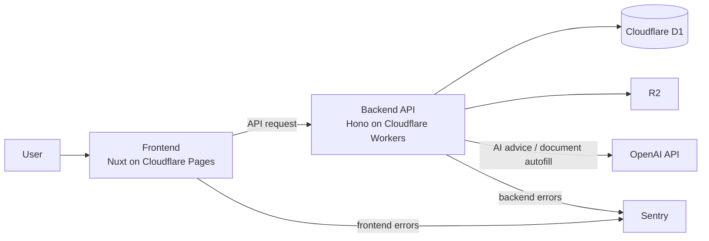

# Rails、お前だったのか。

いつもレールの上を走らせてくれてたのは。

Cloudflare + Hono で新規開発して、Rails のレールの価値を痛感した話

t0yohei @Gotanda.rb#66

---
layout: section
---

# 今日の結論

---

# Rails のレールはとてもいい

- 軽さを求めて Rails を外した
- すると、Rails が吸収していた設計・運用コストが見えた
- 自由は増える
- でも、そのぶん自分で決めることも増える

結論: Rails の default は、ただのおせっかいじゃない

---
layout: two-cols
layoutClass: gap-12
---

# なぜ Hono を選んだのか

新規サービスのバックエンドを Hono で作ってみた

- Cloudflare に全部載せて「うまい・早い・安い」を味わいたかった
- 開発者は自分ひとり
- できるだけ軽い構成にしたかった
- Nest.js ほど重いものは避けたかった

なので Hono を選択

::right::

---

# kodatelog のサービス構成

Pages + Workers + D1 + R2 を基本に、AI機能と監視を後ろに載せている

---
layout: two-cols
layoutClass: gap-12
---

# 使ってみて気づいたこと

- Rails では自然にできていたことが、自然には起きない
- 仕組みは用意されていても、設計は自分でやる必要がある
- その差が、少人数開発ではじわじわ効いてくる

::right::

困ったのは Hono ではなく、Rails の標準装備がなくなったことだった

Rails のレール = 運用知見のプリセット

---

# 具体例① log / masking

- Hono には logging middleware の仕組みはある
- でも、何をどう出すかは自分で決めて実装する必要がある
- Rails は default でログが出る
- `config/initializers/filter_parameter_logging.rb` で `password`, `email`, `secret` などをマスクできる
- Hono ではそこも自前実装になった

---

# 具体例② rollback

- Rails は rollback が便利
- ローカルでテーブル定義を試して戻すのがかなり楽
- Hono + Drizzle ORM では rollback を運用で補う必要があった
- 例: migration と一緒に rollback 用 migration も作る仕組みを用意した

Rails の rollback は、開発速度にかなり効果的

---
layout: two-cols
layoutClass: gap-8
---

# 具体例③ ID 設計

- Hono では特に縛りがなかった
- なんとなく UUID を採用した
- でも、関連データを目視で追いづらくて後悔した

個人的には default が auto increment の方がありがたかった

::right::

  
  
  
UUID は一意性には強いけど、目視追跡はかなりつらい

---

# 具体例④ timestamp

- D1(SQLite) だったこともあり、あまり深く考えず unixtime(integer) を保存した
- でも、人間が読むにはかなりつらい
- 調査・分析・運用で日時が直感的にわからない
- integer にも利点はあるけど、個人的には datetime の default がありがたい

  
  
数字としては扱いやすくても、人間には読みにくい

---
layout: center
class: text-center
---

# まとめ

- log
- masking
- rollback
- auto increment
- datetime

こういう default が、少人数開発と運用の負担を減らしてくれていた

自由な軽量フレームワークは気持ちいい。 
でもその自由は、設計責任と運用責任を引き受けることでもある。

結論: Rails のレールはとてもいい

